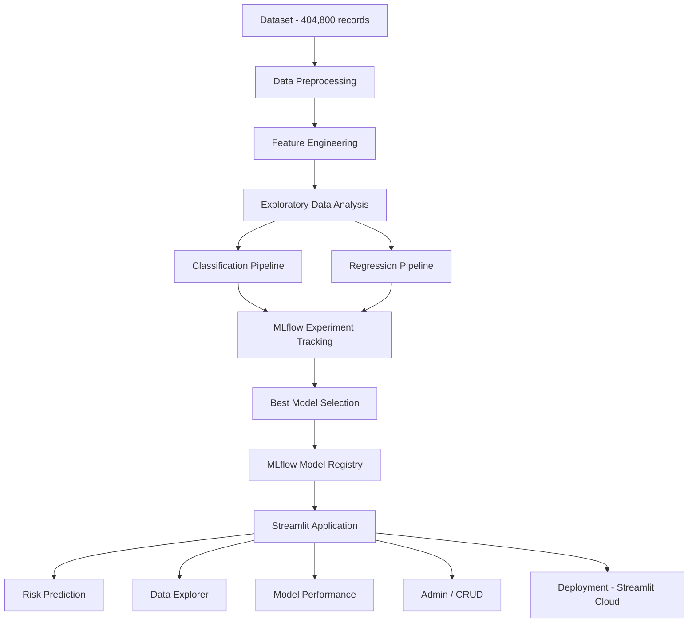
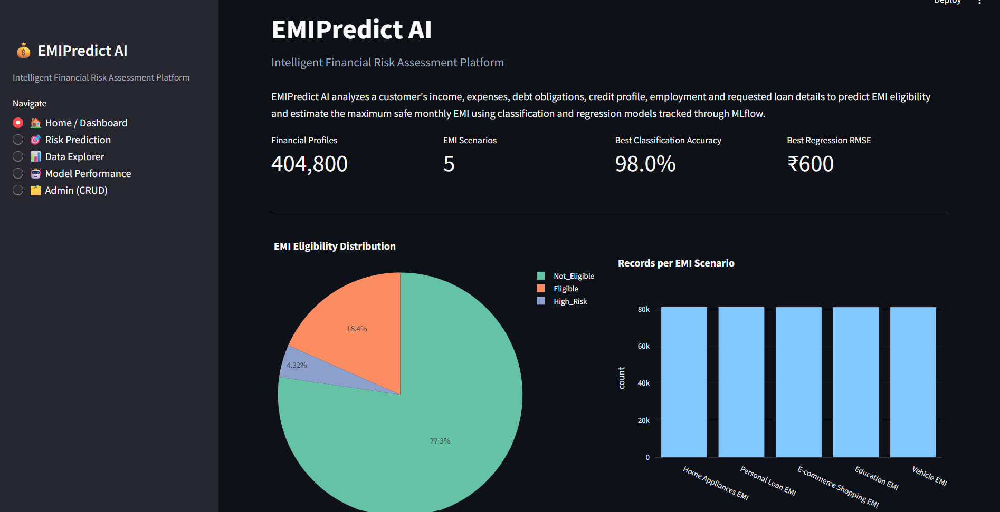
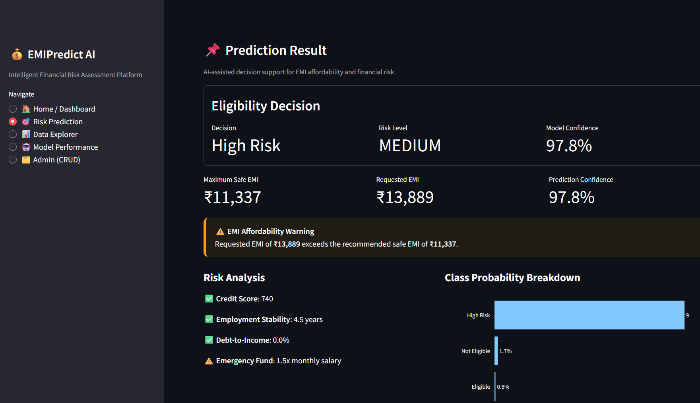
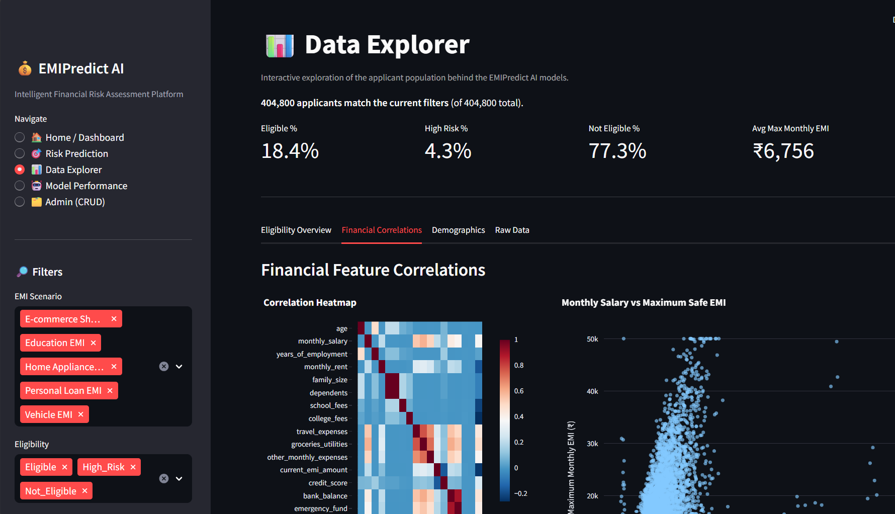
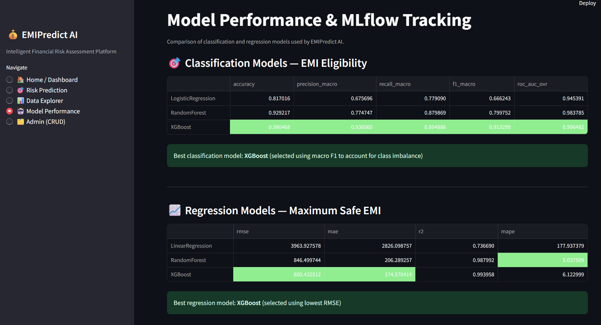
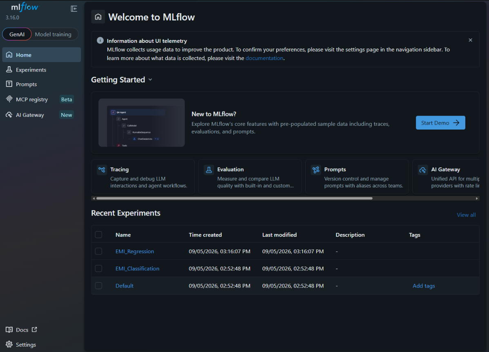
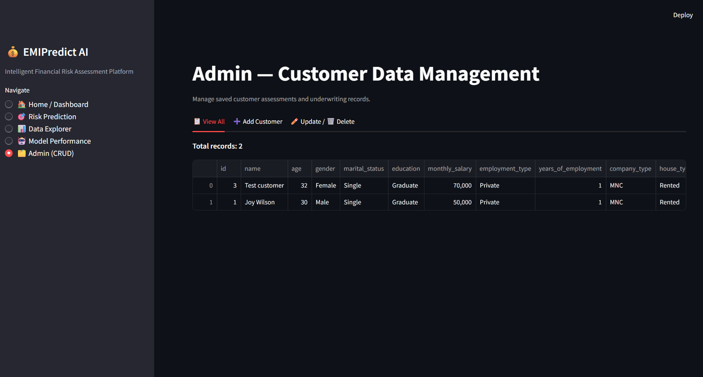

# EMIPredict AI – Intelligent Financial Risk Assessment Platform


---

## 1. Overview

**EMIPredict AI** is a FinTech machine learning platform that assesses a customer's financial profile and produces two outputs: whether they are eligible for an EMI/loan, and the maximum monthly EMI they can safely afford. The platform combines a classification pipeline and a regression pipeline, tracks every experiment through **MLflow**, and serves the best-performing models through a multi-page **Streamlit** application with built-in customer record management (CRUD).

This project was built as part of an ML internship capstone, following a defined problem statement, dataset specification, and evaluation rubric.

---

## 2. Problem Statement

Manual loan underwriting is slow and inconsistent, and inadequate financial risk assessment contributes to EMI defaults. EMIPredict AI addresses this by using a customer's income, expenses, existing debt, credit history, and employment profile to produce a **data-driven eligibility decision** and a **safe EMI recommendation**, rather than relying solely on manual judgment.

---

## 3. Key Objectives

1. Predict EMI eligibility using a 3-class classification model (`Eligible` / `High_Risk` / `Not_Eligible`)
2. Predict the maximum safe monthly EMI using a regression model
3. Provide explainable risk indicators and affordability recommendations alongside each prediction
4. Track and compare ML experiments using MLflow, including a model registry
5. Deliver an interactive multi-page Streamlit application
6. Support full CRUD operations for customer/application records
7. Prepare the project for Streamlit Cloud deployment

---

## 4. Key Features

- Dual ML pipeline: classification (eligibility) + regression (max safe EMI) on a shared feature set
- 15+ engineered financial ratio and risk features
- 3 classification models and 3 regression models, each logged and compared in MLflow
- Model registry entries for the selected production models
- Rule-based explanation layer alongside every prediction (risk checks, affordability status, recommendation)
- Multi-page Streamlit app: Dashboard, Risk Prediction, Data Explorer, Model Performance, Admin (CRUD)
- SQLite-backed customer record storage with create/read/update/delete support

---

## 5. Business Use Cases

| Stakeholder               | Use Case                                                                                |
| ------------------------- | --------------------------------------------------------------------------------------- |
| Financial Institutions    | Reduce manual underwriting effort with a standardized, data-driven eligibility check    |
| FinTech / Digital Lenders | Instant pre-qualification screening before a full loan application                      |
| Banks & Credit Agencies   | Loan amount recommendations grounded in a customer's actual financial capacity          |
| Loan Officers             | A supporting reference point that summarizes a customer's financial profile in one view |

> These are illustrative use cases the platform's outputs are suited to support, not claims of current deployment in any institution.

---

## 6. Dataset

- **Records:** 404,800 financial profiles
- **Input features:** 22 financial and demographic variables
- **EMI scenarios (5):** E-commerce Shopping EMI, Home Appliances EMI, Vehicle EMI, Personal Loan EMI, Education EMI
- **Targets (2):**
  - `emi_eligibility` — classification target, 3 classes: `Eligible`, `High_Risk`, `Not_Eligible`
  - `max_monthly_emi` — regression target, continuous value in INR

**Feature groups:**

| Category                  | Fields                                                                                            |
| ------------------------- | ------------------------------------------------------------------------------------------------- |
| Demographics              | `age`, `gender`, `marital_status`, `education`                                                    |
| Employment                | `monthly_salary`, `employment_type`, `years_of_employment`, `company_type`                        |
| Household                 | `house_type`, `monthly_rent`, `family_size`, `dependents`                                         |
| Monthly Obligations       | `school_fees`, `college_fees`, `travel_expenses`, `groceries_utilities`, `other_monthly_expenses` |
| Credit & Financial Status | `existing_loans`, `current_emi_amount`, `credit_score`, `bank_balance`, `emergency_fund`          |
| Loan Request              | `emi_scenario`, `requested_amount`, `requested_tenure`                                            |

**Data quality handling:** the raw dataset required cleaning before modeling — malformed numeric strings (e.g. repeated decimal suffixes in `age`, `monthly_salary`, `bank_balance`), ~0.6% missing values across several columns, out-of-spec `credit_score` values (documented range 300–850, actual range up to 1200), and a small number of `max_monthly_emi` outliers above the documented ₹50,000 cap. These were resolved through regex normalization, median/mode imputation, and range clipping in `src/preprocessing.py`.

---

## 7. Feature Engineering

Derived features were built to capture affordability and risk signals not directly present in the raw fields:

| Feature                      | Purpose                                                            |
| ---------------------------- | ------------------------------------------------------------------ |
| `total_monthly_expenses`     | Aggregates all recurring monthly obligations                       |
| `debt_to_income`             | Existing EMI burden relative to income                             |
| `expense_to_income`          | Overall spending relative to income                                |
| `remaining_income`           | Income left after all monthly expenses                             |
| `financial_buffer_ratio`     | Remaining income as a share of income — a comfort margin indicator |
| `requested_emi_estimate`     | Implied EMI from the requested loan amount and tenure              |
| `emi_to_income`              | Requested EMI relative to income — core affordability signal       |
| `loan_to_income`             | Requested amount relative to annual income                         |
| `emergency_fund_months`      | Emergency fund expressed in months of expenses covered             |
| `bank_balance_to_income`     | Liquidity relative to income                                       |
| `employment_stability_score` | Normalized years of employment (0–1 scale)                         |
| `credit_risk_score`          | Binned credit score (5 ordinal risk tiers)                         |
| `dependents_ratio`           | Dependents as a share of household size                            |
| `income_x_credit`            | Interaction between income and creditworthiness                    |
| `debt_x_dependents`          | Interaction between debt burden and dependent count                |

Categorical variables are label-encoded and numeric features are standardized using a scaler fit on the training set only, to avoid data leakage into validation/test splits.

---

## 8. Machine Learning Approach

**Classification — EMI Eligibility (3 models):**

- Logistic Regression (baseline, interpretable)
- Random Forest Classifier
- XGBoost Classifier

Evaluated on: Accuracy, Precision, Recall, Macro F1, ROC-AUC.

> The eligibility classes are imbalanced (`Not_Eligible` ≈77%, `Eligible` ≈18%, `High_Risk` ≈4%), so `class_weight="balanced"` is used during training and **Macro F1** — not raw accuracy — is the primary metric for model selection, since a naive classifier could exceed 90% accuracy while never correctly predicting `High_Risk`.

**Regression — Maximum Safe Monthly EMI (3 models):**

- Linear Regression (baseline)
- Random Forest Regressor
- XGBoost Regressor

Evaluated on: RMSE, MAE, R², MAPE.

---

## 9. Model Performance

**Project target:** Classification accuracy > 90%, Regression RMSE < ₹2,000.

### Classification Results

| Model               | Validation Accuracy | Test Accuracy | Test Macro F1 | Test ROC-AUC |
| ------------------- | ------------------- | ------------- | ------------- | ------------ |
| Logistic Regression | —                   | —             | —             | —            |
| Random Forest       | —                   | —             | —             | —            |
| **XGBoost (best)**  | **98.05%**          | **98.20%**    | **92.03%**    | **99.69%**   |

### Regression Results

| Model              | Validation RMSE | Test RMSE   | Test MAE    | Test R²     | Test MAPE |
| ------------------ | --------------- | ----------- | ----------- | ----------- | --------- |
| Linear Regression  | —               | —           | —           | —           | —         |
| Random Forest      | —               | —           | —           | —           | —         |
| **XGBoost (best)** | **₹600.43**     | **₹565.13** | **₹172.78** | **0.99465** | **6.04%** |

Both selected models exceed the project's target thresholds — classification accuracy is ~8 points above the 90% target, and regression RMSE is roughly 3.5x tighter than the ₹2,000 target. Full per-model comparison tables (including Logistic Regression / Linear Regression and Random Forest baselines) are generated at `models/classification_comparison.csv` and `models/regression_comparison.csv` after training, and are also viewable on the app's **Model Performance** page.

---

## 10. MLflow Experiment Tracking & Registry

Every training run — across both problems and all six models — is logged to MLflow with:

- **Parameters:** model hyperparameters for each run
- **Metrics:** the full evaluation metric set (accuracy/precision/recall/F1/ROC-AUC for classification; RMSE/MAE/R²/MAPE for regression)
- **Artifacts:** the trained model object for each run
- **Comparison:** all runs within an experiment can be compared side-by-side in the MLflow UI
- **Model Registry:** the best-performing model from each problem is registered for versioned, production-style access

**Registered models:**

- `EMIPredict_Classification`
- `EMIPredict_Regression`

**Experiments:** `EMI_Classification`, `EMI_Regression`

---

## 11. Streamlit Application

A multi-page app built on the trained models:

### 🏠 Home / Dashboard

Platform overview, dataset scale, and headline model metrics (best classification accuracy, best regression RMSE).

### 🎯 Risk Prediction

The core interaction. Given a customer's financial profile, the app returns:

- Eligibility decision (`Eligible` / `High_Risk` / `Not_Eligible`)
- Risk level (Low / Medium / High)
- Model confidence and class probability breakdown
- Maximum safe monthly EMI
- Requested EMI (derived from requested amount and tenure)
- EMI affordability status (Comfortable / Stretched)
- A rule-based risk analysis (credit score, employment stability, debt-to-income, emergency fund)
- A plain-language recommendation
- Option to save the assessment to the Admin customer records

### 📊 Data Explorer

Dataset overview, eligibility distribution, financial correlations, demographic and scenario-level breakdowns via interactive Plotly charts.

### 🤖 Model Performance

Side-by-side comparison tables for all classification and regression models, with the best model highlighted, plus instructions for opening the full MLflow comparison dashboard.

### 🗂️ Admin (CRUD)

Create, view, update, and delete customer records stored in SQLite.

---

## 12. Data Explorer Details

- Dataset overview (row/column counts, missing value summary)
- Eligibility distribution analysis
- Salary and credit score distributions
- Eligibility vs. credit score / salary breakdowns
- Requested amount and max EMI by scenario
- Correlation heatmap across numeric features
- Interactive Plotly visualizations throughout

---

## 13. CRUD Management

Customer/application records are stored in SQLite (`data/emi_customers.db`) via `src/database.py`, supporting:

- **Create** — add a new customer record (manually, or automatically when saving a prediction)
- **Read** — view all stored records in a table
- **Update** — edit fields on an existing record
- **Delete** — remove a record

This is intentionally a lightweight, single-table implementation suited to a project of this scope — not a production banking schema.

---

## 14. System Architecture



---

## 15. Project Structure

```
EMIPredict-AI/
├── app.py                       # Streamlit application entry point
├── requirements.txt
├── README.md
├── data/                        # raw + processed datasets, SQLite DB
├── models/                      # saved best models, comparison tables
├── mlruns/                      # MLflow tracking store
├── notebooks/                   # exploratory analysis notebooks
└── src/
    ├── preprocessing.py         # cleaning, validation, train/val/test split
    ├── feature_engineering.py   # derived ratios, encoding, scaling
    ├── train_classification.py  # 3 classifiers + MLflow logging
    ├── train_regression.py      # 3 regressors + MLflow logging
    ├── predict.py                # inference pipeline used by the app
    └── database.py               # SQLite CRUD for customer records
```

---

## 16. Installation & Setup

```bash
git clone <repository-url>
cd EMIPredict-AI

python -m venv .venv
.venv\Scripts\activate

python -m pip install --upgrade pip
pip install -r requirements.txt
```

---

## 17. Running the Project

```bash
streamlit run app.py
```

To inspect experiment tracking and the model registry:

```bash
mlflow ui --backend-store-uri sqlite:///mlflow.db
```

Then open **http://localhost:5000** in your browser.

---

## 18. Model Training

Run in order:

```bash
python src/preprocessing.py
python src/feature_engineering.py
python src/train_classification.py
python src/train_regression.py
```

Each training script logs all runs to MLflow and saves the best model to `models/`.

---

## 19. Live Demo

> Deployment URL: [Add Streamlit Cloud URL]

---

## 20. Screenshots

### Dashboard



### Risk Prediction



### Data Explorer



### Model Performance



### MLflow



### Admin CRUD



---

## 21. Why This Project Matters

Financial eligibility decisions are usually made with limited, manually-reviewed information. This project demonstrates an end-to-end alternative: a reproducible pipeline that goes from raw financial data to a tracked, versioned, explainable model output — covering the full lifecycle a real ML system needs (cleaning, feature engineering, multi-model comparison, experiment tracking, and a usable interface), rather than a single notebook with one model.

---

## 22. Business Impact

- Provides a consistent, repeatable basis for EMI eligibility screening instead of ad hoc manual review
- Surfaces a specific, explainable maximum-safe-EMI figure rather than a binary approve/reject decision
- Gives loan officers a structured risk breakdown (credit, employment stability, debt-to-income, emergency fund) alongside the model's output

> These are the capabilities the platform provides; they are not claims of measured impact within a live institution, since the platform has not been deployed in a production lending environment.

---

## 23. Limitations / Notes

- Model hyperparameters are lightly tuned defaults, not the result of exhaustive search (e.g. grid/Bayesian search)
- The MLflow model registry stores the selected best models but does not yet implement staged promotion (staging → production) workflows
- The SQLite-backed CRUD store is suited to single-user/demo use, not concurrent production writes
- Reported metrics reflect a single train/validation/test split; k-fold cross-validation was not performed
- The app has not yet been deployed publicly — see [Live Demo](#19-live-demo)

---

## 24. Future Enhancements

- Hyperparameter tuning via grid search or Bayesian optimization
- MLflow model registry stage transitions (Staging/Production) with automated promotion criteria
- Cross-validation for more robust performance estimates
- SHAP-based explainability to replace/augment the current rule-based risk explanation
- Migration from SQLite to a multi-user database for production CRUD use
- Authentication for the Admin interface

---

## 25. Key Takeaways (For Evaluators)

- Both required ML problems (classification + regression) are implemented with the required minimum of 3 models each
- The selected models (XGBoost for both) exceed the project's target metrics: 98.20% test accuracy (target >90%) and ₹565.13 test RMSE (target <₹2,000)
- Class imbalance in the eligibility target was identified and addressed (`class_weight="balanced"`, Macro F1 as the selection metric) rather than ignored
- Data quality issues in the raw dataset (malformed numerics, missing values, out-of-spec ranges) were identified and explicitly handled, not silently dropped
- All required deliverables are present: preprocessing pipeline, feature engineering, 3+3 models, MLflow tracking + registry, multi-page Streamlit app, and CRUD

---

## Live Demo

[](https://emipredict-ai-ku5nzublfosrywbffh2gjv.streamlit.app/)

## 26. Author

**Ritika**
ML Internship Capstone Project

---

## 27. License

This project is licensed under the MIT License.
